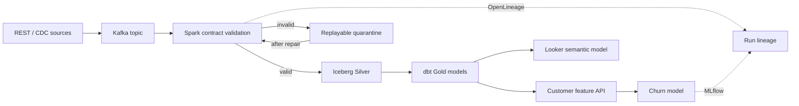

# Architecture

DriftOps is intentionally two runtimes with one browser-facing contract.

## Runtime Boundary

The hosted recruiter demo uses a Cloudflare Worker and D1 because its workload is interactive and low-volume. It executes the same state transitions, contract outcomes, quarantine rules, and replay gates as the Python domain model. The production reference runtime uses Kafka, Spark Structured Streaming, Iceberg-compatible storage, dbt, Airflow, FastAPI, MLflow, Postgres, and Looker.

The serverless demo does not claim distributed scale. It exists so a reviewer can exercise the failure semantics in under two minutes without cloud credentials or a local cluster.

## Guarantees

| Concern | Decision | Tradeoff |
| --- | --- | --- |
| Delivery | At-least-once plus idempotent `event_id` | Duplicates are detectable and recoverable; exactly-once is not promised across every sink. |
| Bad data | Quarantine per record; block affected Gold publication | Valid traffic keeps moving while downstream consumers avoid partial truth. |
| Late data | Event-time watermark and explicit backfill | Wider watermarks improve completeness but increase state and latency. |
| Schema | Versioned JSON/Avro contracts; incompatible changes fail | Producers need a compatibility window for breaking releases. |
| AI RCA | Evidence-constrained explanation after deterministic checks | AI explains an incident; it does not decide whether a contract passed. |
| Reproducibility | Run ID + dataset hash + contract + code + model version | Metadata storage adds cost but makes replay and audit possible. |

## Failure States

`running -> incident -> repairing -> healthy`

Repair cannot run before detection. Replay cannot run before repair. A replay is successful only when quarantined count returns to zero and every contract check passes.
